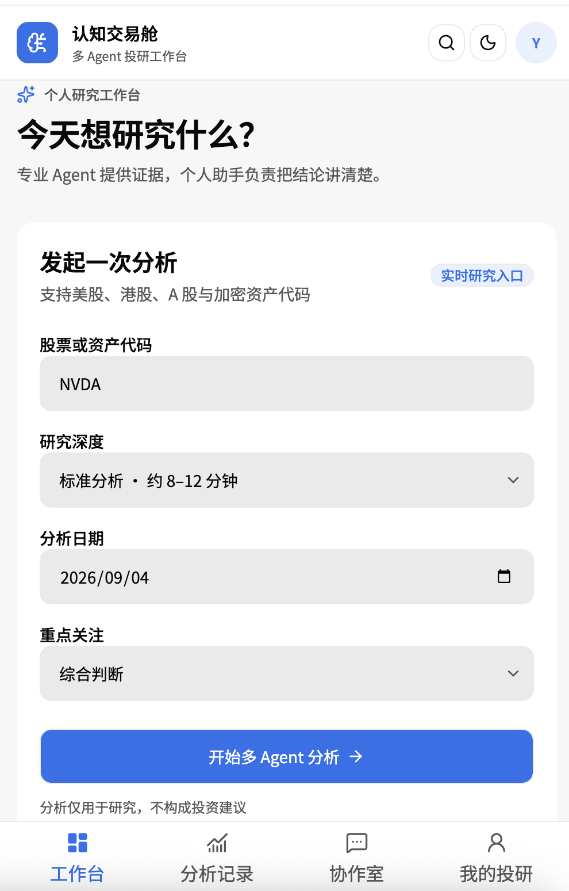
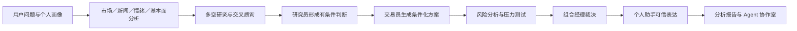

# AI投研助手-认知交易舱

面向普通投资者的多 Agent AI 投研助手：从碎片化财经信息中提取关键证据，通过多视角讨论与交叉验证形成可信结论，并由个人助手用用户能够理解的语言解释。

> 本项目用于 AI 产品原型与投研流程演示，不构成投资建议。仓库中的 NVDA 预置案例为非实时演示数据。

<p align="center">
  
</p>

## 为什么做这个产品

普通投资者每天面对行情、新闻、公告、研报摘要和社交讨论，既难以判断信息的重要程度，也容易把 AI 最新给出的一条结论直接理解为买卖建议。

认知交易舱围绕两个核心问题设计：

1. **过滤信息噪音**：沿用 TradingAgents 的专业分工与分析机制，整合市场、新闻、情绪和基本面证据。
2. **形成可信判断**：通过多空研究、交易方案、风险讨论与组合经理裁决呈现分歧，并明确事实、推断、未知和失效条件。

## 核心功能

| 功能 | 产品作用 |
| --- | --- |
| 工作台 | 输入股票或资产代码，选择研究深度、日期和关注重点；结合 AI 自选股与最近浏览进入研究 |
| 分析记录 | 展示多 Agent 实时进度、个人助手摘要、组合经理结论及各角色研究依据 |
| Agent 协作室 | 提供投研总工作群及角色单聊，从市场、新闻、研究、交易和风险等视角回答追问 |
| 我的投研 | 沉淀关注周期、信息偏好和风险关注点，让 Agent 调整解释方式，但不改变事实本身 |

## Agent 工作流程



用户界面将 TradingAgents 后台角色聚合为更容易理解的角色：市场分析师、情绪分析师、新闻分析师、基本面分析师、研究员、交易员、风险分析师、组合经理和个人助手。

## 可信表达规范

个人助手和专业 Agent 的输出遵循统一结构：

- **事实**：已有行情、公告或研究材料能够直接支持的信息。
- **推断**：基于事实形成的分析判断，不等同于未来必然发生。
- **未知**：当前材料无法确认、需要新数据验证的内容。
- **相反证据**：可能削弱当前结论的重要信息。
- **失效条件**：哪些变化出现后需要重新分析。

对于“现在该买还是该卖”等问题，个人助手会进一步确认持仓状态、关注周期和风险承受能力，不提供无条件交易指令。

## 快速体验

### 离线演示

克隆仓库后直接打开：

```text
submission/demo/index.html
```

离线版可以完整演示工作台、NVDA 预置分析、可信摘要、Agent 群聊／单聊和个人投研画像，不需要 API Key。

### 本地开发

前端要求 Node.js 22.13 或更高版本：

```bash
cd web
npm install
npm run dev
```

浏览器访问 <http://localhost:3000>。

如需运行真实 TradingAgents 分析，先在项目根目录安装 Python 依赖并配置服务商密钥，再启动本地 API：

```bash
pip install -e .
pip install -r web/backend/requirements.txt
export DEEPSEEK_API_KEY="你的 DeepSeek API Key"
cd web
uvicorn backend.app:app --host 127.0.0.1 --port 8000
```

API Key 只能保存在本地或部署平台的后端环境变量中，不要写入前端变量或提交到 GitHub。

## Netlify 部署

仓库根目录已包含 `netlify.toml`，在 Netlify 中导入本仓库即可构建前端：

- Base directory：`web`
- Build command：`npm run build`
- Publish directory：`dist`

仅部署前端时可以演示预置案例。实时分析和自定义实时对话需要单独部署 Python API，并在 Netlify 配置 `VITE_API_URL`。

## 产品文档

- [产品经理 PRD](submission/PRD.md)
- [Agent 流程与角色映射](submission/AGENT_FLOW.md)
- [产品与交互方案说明](submission/PRODUCT_INTERACTION_SPEC.html)
- [上线前评估方案](submission/VALIDATION_REPORT.md)
- [Demo 演示说明](submission/demo/README.md)

## 技术栈

- 前端：React 19、TypeScript、Vite、Tailwind CSS
- Web API：FastAPI、Server-Sent Events
- Agent 框架：TradingAgents、LangGraph
- LLM 服务：支持 DeepSeek 及 TradingAgents 已适配的其他模型服务商
- 部署：GitHub、Netlify；实时后端需独立部署

## 当前边界

- 预置案例不能代表当前行情，也不能用于现实投资判断。
- 未部署后端时，新的实时分析与任意实时聊天不可用。
- 用户画像目前是演示态页面数据，尚未实现登录、多用户隔离和云端同步。
- 产品不连接券商、不执行交易，也不提供确定性收益承诺。

## 开源来源与许可

本项目基于 [TauricResearch/TradingAgents](https://github.com/TauricResearch/TradingAgents) 开源框架进行产品化设计与 Web 交互扩展。原框架提供多 Agent 投研逻辑，本项目新增普通投资者工作台、可信表达、个人投研画像和 Agent 协作室等产品能力。

项目沿用 [Apache License 2.0](LICENSE)。使用或二次开发时请同时遵守原项目许可及金融数据、模型服务商的相关条款。
