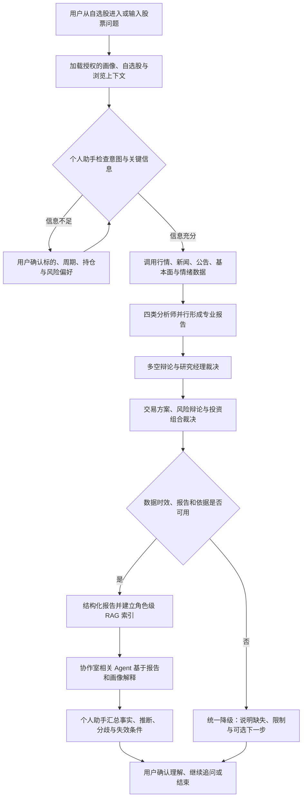

# Agent 流程｜TradingAgents 多视角 AI 投研助手

## 1. 流程目标

- **核心用户**：关注 3–20 只股票、缺乏完整专业投研框架的普通自主投资者。
- **触发场景**：自选股异动、出现重要新闻或发布财报后，用户希望快速判断投资逻辑是否变化。
- **核心任务**：从碎片化信息中提取关键事实，通过多 Agent 专业分析和多视角讨论，形成可理解、可追溯、有边界的判断。
- **成功结果**：用户能说出至少一条支持证据、一条反对证据、一个未知点和一个失效条件，并自行决定是否继续研究或采取行动。

## 2. 分层架构与角色边界

| 层级 | 角色 | 来源 | 职责边界 |
|---|---|---|---|
| 用户交互层 | 个人助手 | 产品新增 | 加载用户画像、识别意图、澄清信息、调度角色、适配语言、汇总分歧；不重算专业结论 |
| 信息分析层 | 市场分析师、情绪分析师、新闻分析师、基本面分析师 | TradingAgents 原生 | 分别产出市场、情绪、新闻和基本面报告 |
| 研究决策层 | 后台：多头、空头、研究经理；前台：研究员 | TradingAgents 原生 + 展示聚合 | 后台形成最强正反论点并裁决；前台由一个研究员呈现支持、反对、分歧与结论 |
| 交易方案层 | 交易员 | TradingAgents 原生 | 将研究计划转为条件化交易方案，不替用户执行交易 |
| 风险管理层 | 后台：激进、中性、保守；前台：风险分析师；另保留投资组合经理 | TradingAgents 原生 + 展示聚合 | 后台从三种风险立场挑战方案；前台由一个风险分析师汇总三种情景 |
| 检索解释层 | 角色级 RAG 与协作室路由 | 产品新增 | 从同一分析批次中检索角色报告和证据，支持群聊与单聊 |

角色英文映射：Market Analyst、Sentiment Analyst、News Analyst、Fundamentals Analyst、Bull Researcher、Bear Researcher、Research Manager、Trader、Aggressive Analyst、Neutral Analyst、Conservative Analyst、Portfolio Manager。

## 3. 主流程与统一降级流程



主路径保持“用户触发—信息检查—工具调用—专业分析—结果检查—多视角解释—用户确认”的闭环；所有数据不足、接口失败和证据不可靠情况合并到一个降级分支。

## 4. 节点说明

| 节点 | 输入 | Agent 判断/动作 | 数据或工具 | 输出 | 失败处理 |
|---|---|---|---|---|---|
| A 发起任务 | 股票代码、自然语言问题 | 记录任务入口和当前页面 | 自选股或股票搜索 | 待分析任务 | 无法识别代码时提示示例 |
| B 加载上下文 | 用户授权数据 | 组合明确设置、行为记录和本次上下文 | 用户画像、自选股、浏览记录 | 用户上下文包 | 未授权时仅使用本次输入 |
| C 信息检查 | 问题、上下文包 | 判断问题类型及所需信息 | 意图识别规则/LLM | 可执行任务或缺失项 | 进入 D 澄清 |
| D 用户确认 | 缺失项 | 询问标的、日期、周期、持仓、风险偏好中的必要项 | 表单/对话 | 已确认任务 | 用户可取消或按有限信息继续 |
| E 数据调用 | 已确认任务 | 制定数据调用范围并获取数据 | 行情、技术、基本面、新闻、宏观、情绪接口 | 带时间戳的原始材料 | 记录失败数据源，继续可用部分 |
| F 分析师并行 | 原始材料 | 四类分析师分别生成报告 | TradingAgents 分析师节点 | 四类专业报告 | 缺少关键报告则标记不完整 |
| G 研究辩论 | 四类报告 | 多空构建论点，研究经理评估证据冲突 | Bull/Bear/Research Manager | 研究计划 | 证据冲突且不足时倾向保持观察 |
| H 交易与风险 | 研究计划 | 交易员提出条件化方案，三类风险角色挑战，投资组合经理裁决 | Trader/Risk/Portfolio Manager | 最终专业决策 | 不执行交易，仅输出方案 |
| I 结果检查 | 全部报告、时间戳、调用状态 | 检查关键字段、时效和依据是否足够 | 规则检查+报告状态 | 可用/不可用 | 不可用进入 X |
| J 结构化与索引 | 可用报告 | 按标的、批次、角色、章节、时间切分 | 本地结构化数据/RAG 索引 | 可检索报告 | 索引失败仍可展示原报告 |
| K 协作室回答 | 用户追问、检索片段、画像 | 路由相关角色；生成专业层与用户解释层 | RAG+角色提示词 | 多视角回答 | 检索不足时明确“报告未覆盖” |
| L 个人总结 | 多角色回答、用户画像 | 汇总共识与分歧，标注事实/推断/未知/失效条件 | 个人助手提示词 | 可信总结 | 不生成超出报告的新事实 |
| M 用户确认 | 可信总结 | 接收继续追问、刷新、纠正画像或结束 | UI 交互 | 用户拥有最终决定 | 不提供自动交易入口 |
| X 统一降级 | 缺失数据或检查失败 | 说明缺失来源、影响范围、可选动作 | 状态信息 | 有边界的有限结论 | 用户选择补充、重试或终止 |

## 5. 用户上下文包

```text
user_context = {
  explicit_profile: {
    knowledge_level,
    typical_horizon,
    focus_dimensions,
    explanation_preference,
    preferred_markets
  },
  authorized_behavior: {
    watchlist,
    recent_views,
    viewed_reports,
    frequent_topics,
    frequent_agent_chats
  },
  current_task: {
    ticker,
    analysis_date,
    question,
    holding_status?,
    current_horizon?,
    confirmed_risk_preference?
  },
  prohibited_inferences: [
    unprovided_asset_size,
    unconfirmed_risk_tolerance,
    unprovided_cost_basis,
    unconfirmed_real_position
  ]
}
```

- `explicit_profile` 由用户主动填写或确认。
- `authorized_behavior` 仅包含产品内、用户授权的数据，可删除或关闭。
- `current_task` 是本次问答的优先上下文；与长期画像冲突时必须当次确认。
- AI 推测标签不得冒充用户事实，风险承受能力不得由浏览记录推断。

## 6. 专业分析与个性化解释分离

```text
市场数据与报告证据 ──> 专业分析层 ──> 角色结论
                                      │
用户画像与本次上下文 ──> 表达适配层 ──> 用户可理解的解释
```

专业分析层决定“事实是什么、证据支持什么”；表达适配层只决定“先解释什么、使用什么术语、解释到多深”。用户画像不能修改数据、证据权重或角色立场。

## 7. 报告到角色级 RAG 的映射

| 报告内容 | 默认回答角色 | 检索边界 |
|---|---|---|
| 市场/技术分析报告 | 市场分析师 | 当前标的、当前批次、市场章节 |
| 情绪分析报告 | 情绪分析师 | 当前标的、当前批次、情绪章节 |
| 新闻与宏观报告 | 新闻分析师 | 当前标的、当前批次、新闻章节 |
| 基本面报告 | 基本面分析师 | 当前标的、当前批次、基本面章节 |
| 多空辩论记录 + 研究经理结论 | 研究员 | 同时检索正反论点、研究计划、主要矛盾和前提 |
| 交易方案 | 交易员 | 条件化行动、时间尺度和风险提示 |
| 三类风险辩论 + 风险裁决 | 风险分析师 | 同时检索乐观、基准、保守情景及综合风险结论 |
| 最终裁决 | 投资组合经理 | 综合裁决及其依据 |

RAG 优先检索报告段落和依据，不只检索最终 BUY/SELL/HOLD 标签；每个片段必须携带标的、分析批次、角色、章节和时间戳。

## 8. 协作室路由逻辑

### 8.1 总工作群

| 问题类型 | 必选角色 | 可选角色 | 个人助手动作 |
|---|---|---|---|
| “最近为什么下跌” | 市场、新闻 | 基本面、情绪 | 汇总已发生事件和可能解释 |
| “财报是否改变长期逻辑” | 基本面、研究员 | 投资组合经理 | 研究员内部展示正反论点并区分事实与未来假设 |
| “现在该买吗/卖吗” | 研究员、风险分析师 | 交易员、投资组合经理 | 补充询问周期/持仓/风险信息，再给条件化总结 |
| “这条新闻重要吗” | 新闻 | 基本面、市场 | 说明相关性、影响路径和时效 |

协作室仅展示 9 个产品角色：个人助手、四类信息分析师、研究员、交易员、风险分析师和投资组合经理。后台原生辩论节点仍完整执行，但不拆成独立聊天成员；每次只调度与问题相关的产品角色，禁止以发言数量进行多空投票。

### 8.2 单聊

- 指定角色优先从自己的报告章节回答。
- 可以引用其他章节作为上下文，但必须标明来源角色。
- 问题超出职责时，说明边界并建议对应角色。
- 单聊观点不能被包装为整个系统的最终结论。

## 9. 输出协议

### 9.1 专业角色协议

```text
角色视角：
已确认事实：
分析推断：
相反证据：
关键假设：
失效条件：
置信度及原因：
报告依据/数据时间：
```

### 9.2 个人助手协议

```text
与你相关的核心问题：
已确认事实：
当前共识：
关键分歧：
仍然未知：
支持行动的条件：
应等待或重新评估的条件：
需要你确认：
```

## 10. AI 自动完成与用户确认

### AI 自动完成

- 加载用户已授权的自选股、浏览记录和画像。
- 识别问题、选择所需数据与相关 Agent。
- 运行 TradingAgents 分析、检查报告并建立索引。
- 从报告中检索依据，生成不同角色的回答。
- 适配解释语言，汇总共识、分歧、未知与失效条件。

### 必须由用户确认

- 股票代码和需要刷新分析的日期。
- 买卖问题所需的持仓状态、投资周期和风险偏好；长期画像已过期或冲突时重新确认。
- 是否接受、修改或删除 AI 推测的画像标签。
- 数据不足时选择补充、重试、查看有限结论或结束。
- 最终是否采取任何现实投资行动。

## 11. Demo 对应关系

| 流程节点 | Demo 页面/状态 | 用户可见反馈 |
|---|---|---|
| A–B | 工作台/AI 自选股 | 自选列表、最近浏览、当前画像摘要 |
| C–D | 股票分析输入 | 标的、问题和必要确认项 |
| E–H | 实时进度 | TradingAgents 各角色的阶段状态 |
| I–J | 分析报告 | 数据时间、报告章节、结果可用状态 |
| K | Agent 协作室 | 总群多视角消息与角色单聊 |
| L–M | 个人助手总结卡 | 事实、推断、未知、分歧、失效条件和用户确认 |
| X | 降级状态 | 缺失来源、影响范围和可选下一步 |

分享版默认使用明确标注的“预置交互案例数据”，不要求评审填写 API Key；本地实时模式作为已有能力保留。预置内容不得标注为真实运行结果或实时行情。

## 12. 关键边界

- Agent 可以：整理信息、调用数据、综合证据、展示多种立场、解释不确定性、请求用户确认。
- Agent 不可以：保证收益、隐藏重要反证、把推断写成事实、根据 Agent 数量投票、自动执行交易。
- 信息不足时：明确缺失内容及其对结论的影响，进入统一降级分支。
- 数据/工具失败时：展示失败来源和数据时间，只保留仍有证据支持的有限结论。
- 用户画像关闭时：继续提供标准专业分析，不做个性化解释或行为推测。
